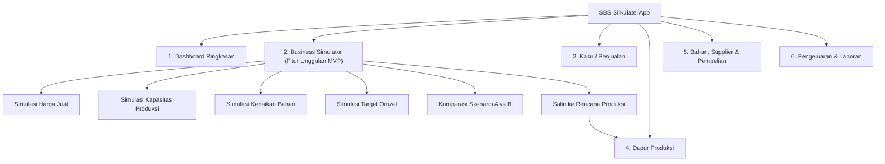
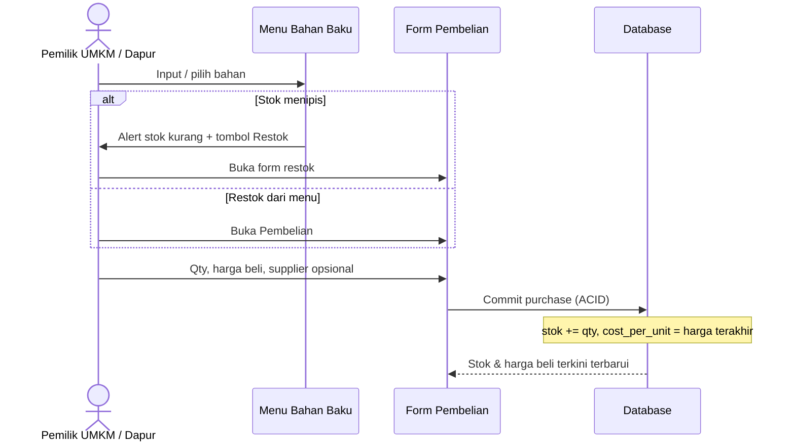
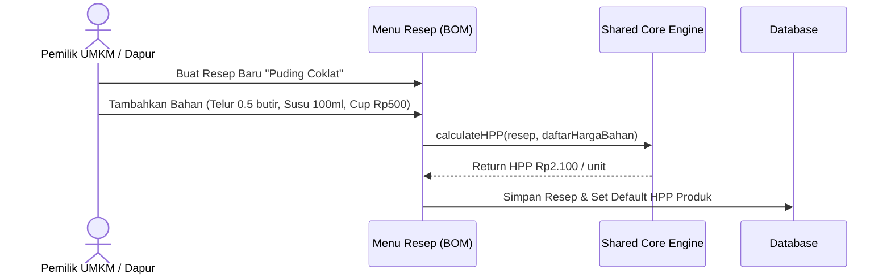
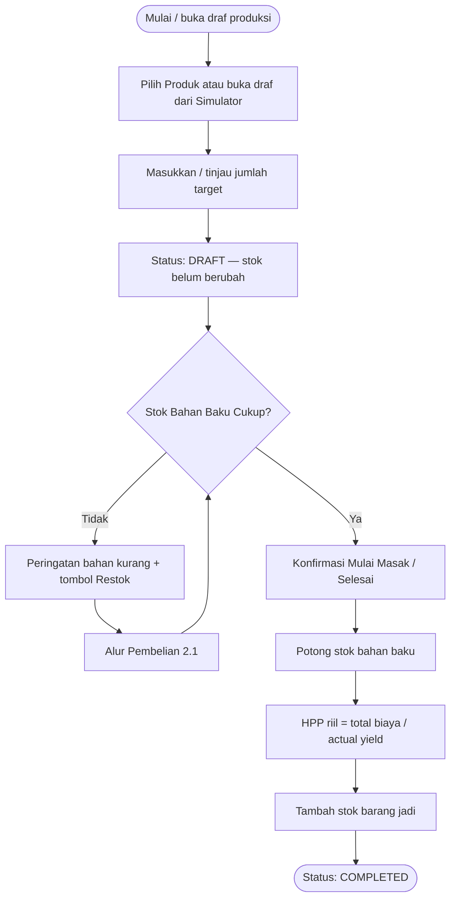
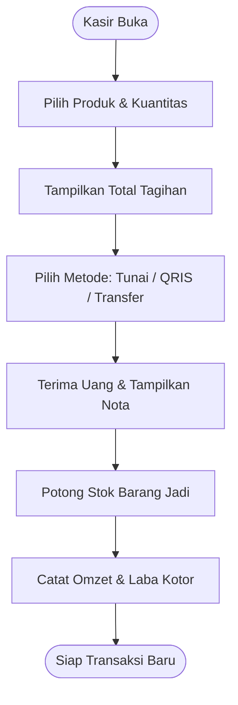
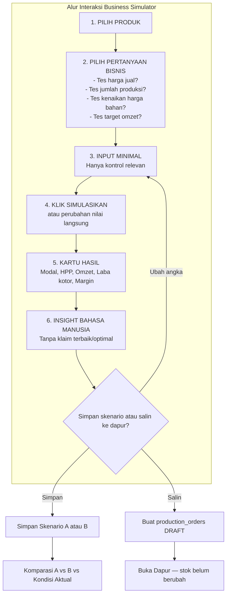
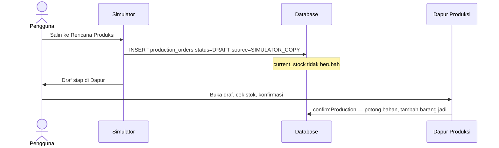
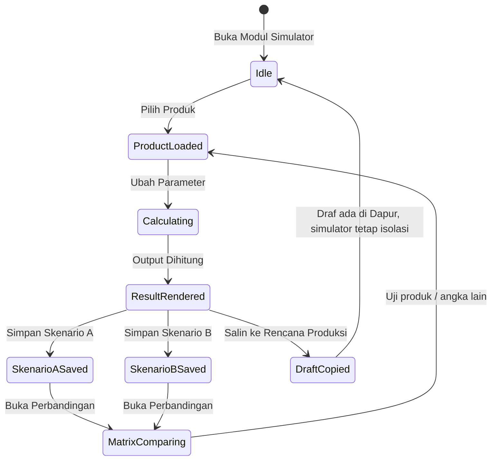
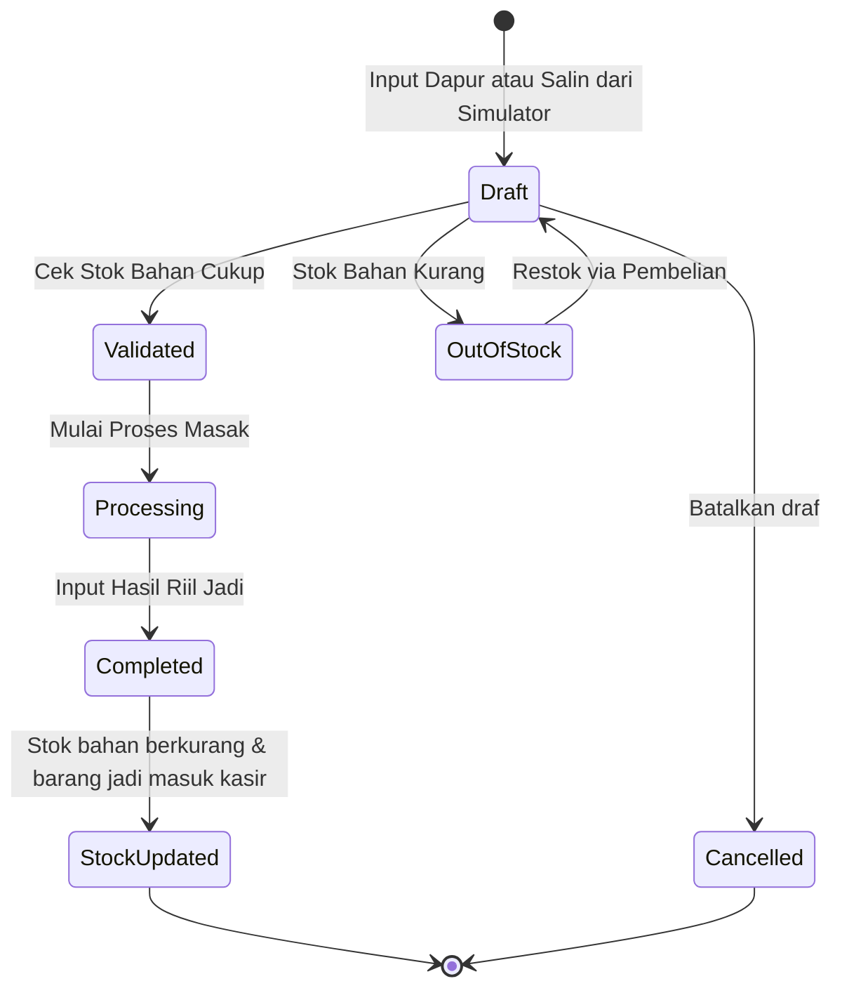

# Application Flow & Process Specifications (APP FLOW)
## Sistem Bisnis Sederhana (SBS Sirkulatel)
*Dokumen Alur Aplikasi & Transisi Status — Versi 1.1 (MVP Rapikan)*
*Pendekatan: Spec-Driven Development (SDD)*

---

## 1. Arsitektur Navigasi Global

Aplikasi mengadopsi navigasi yang ringkas, bersih, dan dioptimalkan untuk mobile maupun tablet/desktop:

---

## 2. Alur Transaksi Operasional Aktual

### 2.1 Alur Pengadaan Bahan, Supplier & Restok

Pembelian bahan tidak menulis ke pengeluaran operasional.

### 2.2 Alur Penyusunan Resep

### 2.3 Alur Produksi Batch Aktual & Pengurangan Stok

### 2.4 Alur Kasir POS & Penjualan Cepat

---

## 3. Alur Business Simulator (Progressive Disclosure)

Sesuai **UX RULE Addendum**, antarmuka simulator **anti-spreadsheet**:

$$\text{Pilih Produk} \longrightarrow \text{Masukkan Angka} \longrightarrow \text{Simulasikan} \longrightarrow \text{Lihat Dampaknya}$$

Tidak semua parameter ditampilkan sekaligus. Markup dan rumus tidak ditampilkan.

---

## 4. Rincian Alur 4 Use Case Wajib Simulator

### 4.1 Use Case 1: Menentukan Harga Jual
1. Pengguna memilih produk: **Puding Coklat**.
2. Sistem menampilkan HPP dasar: **Rp2.100**.
3. Kontrol harga jual: tombol cepat `[Rp3.000]` `[Rp4.000]` `[Rp5.000]` atau input manual.
4. Saat memilih `[Rp5.000]`:
   - Laba kotor per unit: **Rp2.900**
   - Margin: **58.0%**
   - Insight: *"Harga Rp5.000 memberi margin 58.0%, lebih tinggi dibanding Rp3.000 dan Rp4.000 yang Anda coba."*
5. Dilarang: menyebut harga tersebut sebagai harga terbaik.

### 4.2 Use Case 2: Menentukan Jumlah Produksi
1. Pengguna memilih produk: **Puding Coklat**.
2. Pengguna menggeser slider produksi ke: **100 cup**.
3. Sistem menghitung:
   - Estimasi modal: **Rp210.000**
   - Rincian kebutuhan bahan
   - Potensi omzet (harga Rp5.000): **Rp500.000**
   - Potensi laba kotor: **Rp290.000**
   - Margin: **58.0%**
4. Insight: *"Untuk memproduksi 100 cup, Anda perlu menyiapkan modal sekitar Rp210.000."*

### 4.3 Use Case 3: Simulasi Kenaikan Harga Bahan
1. Pengguna membuka *"Kenaikan Harga Bahan"* (panel tersembunyi sampai dipilih).
2. Sistem menampilkan bahan dalam resep Puding Coklat.
3. Pengguna mengubah **Telur** dari **Rp2.000** menjadi **Rp2.500** per butir.
4. Kartu perbandingan:
   - HPP: Rp2.100 → **Rp2.350**
   - Margin (harga jual Rp5.000): 58.0% → **53.0%**
5. Insight: *"Kenaikan harga telur menurunkan margin sekitar 5 poin persentase. Anda tetap untung Rp2.650 per cup."*

### 4.4 Use Case 4: Target Omzet (default)
1. Pengguna memasukkan target omzet: **Rp1.000.000**.
2. Harga jual aktif: **Rp5.000**.
3. Sistem menghitung:
   $$\text{Target unit} = \left\lceil \frac{\text{Rp1.000.000}}{\text{Rp5.000}} \right\rceil = 200\ \text{unit}$$
   $$\text{Modal} = 200 \times \text{HPP per unit}$$
4. Insight: *"Untuk mencapai omzet Rp1.000.000 dengan harga Rp5.000/unit, diperlukan penjualan sekitar 200 unit."*
5. **Opsi lanjutan**: target laba — tidak ditampilkan di langkah awal.
6. Kartu BEP hanya muncul jika pengguna mengisi alokasi biaya tetap.

### 4.5 Salin ke Rencana Produksi

---

## 5. Diagram Transisi Status (State Machine)

### 5.1 Siklus Skenario Simulasi

### 5.2 Siklus Produksi Aktual

Masuk dari simulator **hanya** ke `Draft`. Tidak pernah langsung ke `Completed`.
