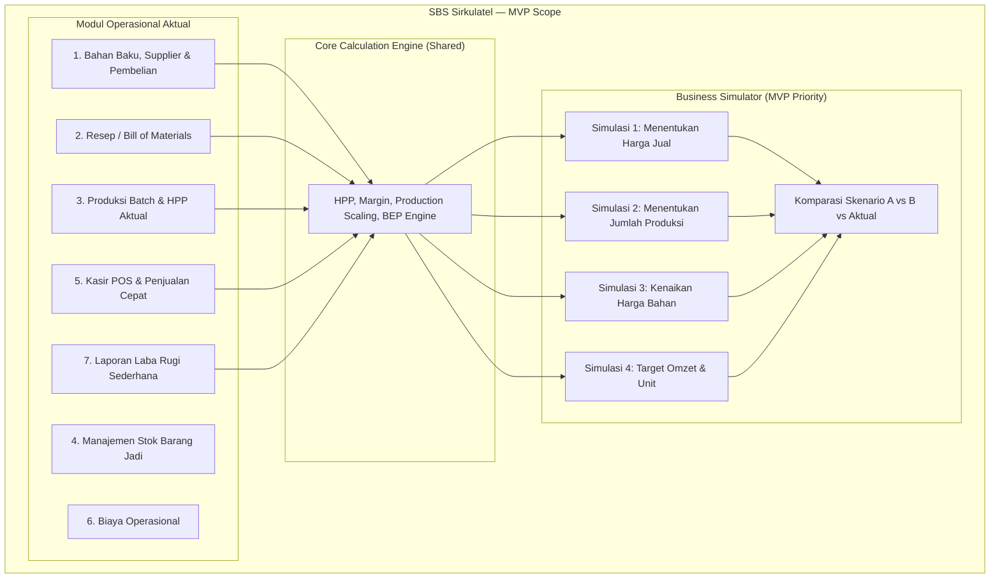

# Product Requirements Document (PRD)
## Sistem Bisnis Sederhana (SBS Sirkulatel)
*Dokumen Spesifikasi Produk — Versi 1.1 (MVP Rapikan)*
*Pendekatan: Spec-Driven Development (SDD)*

---

## 1. Executive Summary & Visi Produk

### 1.1 Latar Belakang
Banyak pelaku usaha mikro, kecil, dan menengah (UMKM) — khususnya sektor kuliner, F&B, bakery, catering, serta pengolahan produk pangan/retail seperti komoditas telur dan turunannya — menghadapi tantangan mendasar dalam pengelolaan operasional harian:
1. **Ketidakpastian HPP (Harga Pokok Penjualan)**: Sulit menghitung biaya bahan baku per porsi secara akurat saat harga bahan baku di pasar berfluktuasi.
2. **Kebutaan Finansial Operasional**: Tidak mengetahui secara pasti apakah harga jual yang ditetapkan menghasilkan laba yang sehat setelah memperhitungkan kemasan dan biaya operasional.
3. **Ketakutan Mengambil Keputusan**: Ragu menaikkan kapasitas produksi atau mengubah harga karena takut rugi tanpa tahu estimasi modal dan titik impas (*break-even point*).
4. **Alat yang Terlalu Rumit**: Aplikasi akuntansi standar atau spreadsheet (Excel) terlalu intimidatif, penuh rumus rumit, dan rentan salah ketik bagi pengguna non-akuntan.

### 1.2 Visi Solusi: SBS Sirkulatel
**SBS Sirkulatel** adalah aplikasi manajemen operasional dan sirkulasi bisnis yang dirancang khusus untuk pelaku usaha produsen mikro. Sistem ini menggabungkan pencatatan harian sederhana (bahan baku $\rightarrow$ pembelian $\rightarrow$ produksi $\rightarrow$ stok $\rightarrow$ penjualan kasir $\rightarrow$ biaya) dengan **Business Simulator terintegrasi sebagai fitur MVP**, memungkinkan pengguna melakukan eksperimen keputusan bisnis ("What-If analysis") secara aman tanpa merusak data aktual.

---

## 2. Target Pengguna (User Persona)

| Persona | Profil & Karakteristik | Masalah Utama | Ekspektasi terhadap SBS |
| :--- | :--- | :--- | :--- |
| **Bu Ani (Pemilik Usaha Olahan / Bakery / Puding)** | Usaha rumahan 3-5 orang staf. Terbiasa mencatat di buku tulis. Tidak paham istilah akuntansi seperti *accrual* atau *depresiasi*. | Sering bingung mematok harga jual ketika harga bahan (telur, susu, gula) naik. Sering kehabisan modal mendadak. | Ingin tahu modal riil per unit, tahu sisa bahan baku, dan bisa simulasi "kalau bikin 100 cup untung berapa". |
| **Pak Budi (Distributor & Retailer Komoditas Telur / F&B)** | Menjual telur partai dan eceran, plus produksi olahan telur asin/kue. Transaksi cepat setiap hari. | Margin tipis. Kenaikan harga beli Rp500/kg dari peternak langsung memangkas seluruh profit jika harga jual lambat disesuaikan. | POS kasir cepat, alert stok menipis, restok mudah, dan simulasi instan margin jika harga beli dari peternak naik. |
| **Rian (Pengelola Operasional / Kasir)** | Staf muda yang mengoperasikan kasir dan mencatat pemakaian bahan di dapur. | Membutuhkan antarmuka yang cepat diakses via HP/tablet, minim klik, dan anti-error. | Input bahan mudah, buat laporan harian otomatis tanpa hitung manual di kalkulator. |

---

## 3. Prinsip Desain & Filosofi Produk

1. **Human-Centric & Anti-Spreadsheet**: Tidak ada tabel rumus membingungkan. Setiap angka disajikan dalam bentuk kartu metrik sederhana dengan penjelasan bahasa manusia (contoh: *"Laba kotor per cup"* bukan *"Gross Margin"* atau *"Markup"*).
2. **Progressive Disclosure**: Menampilkan informasi bertahap sesuai kebutuhan. Pengguna tidak dibombardir dengan puluhan input sekaligus. Tidak semua parameter simulasi dimunculkan bersamaan.
3. **Pemisahan Tegas Data Aktual vs Simulasi**: Menjalankan atau menyimpan simulasi tidak mengubah stok, penjualan, atau keuangan aktual. Satu-satunya jembatan ke data aktual adalah aksi eksplisit **Salin ke Rencana Produksi**, yang hanya membuat draf di modul Dapur — stok baru berkurang setelah konfirmasi di Dapur.
4. **Single Source of Calculation (Shared Logic)**: Rumus di simulator dan rumus di modul aktual menggunakan mesin hitung yang sama (*Core Business Engine*). Simulator tidak boleh punya rumus HPP/margin/produksi tersendiri.
5. **Insight Informatif, Bukan Klaim Optimal**: Sistem boleh membandingkan angka antar skenario. Sistem **tidak boleh** menyatakan suatu harga, volume, atau skenario sebagai "terbaik" / "optimal" tanpa data pasar dan permintaan.

---

## 4. Ruang Lingkup Fitur (MVP Scope)

### 4.1 Modul Operasional Aktual (Transaksional)
1. **Manajemen Bahan Baku, Supplier & Pembelian**:
   - Master bahan baku dengan satuan standar (kg, gram, liter, ml, butir, pcs).
   - Master supplier sederhana (nama, telepon opsional, catatan). Supplier tidak wajib pada setiap pembelian.
   - Pencatatan pembelian/restok: jumlah + harga beli. Setelah commit, stok bahan bertambah dan **harga beli terkini** (`cost_per_unit`) di-update ke harga pembelian terakhir.
   - Pembelian bahan **bukan** biaya operasional; itu penambahan stok.
   - Peringatan stok menipis (*minimum stock threshold*) dengan jalan pintas ke form restok.
2. **Resep / Bill of Materials (BOM)**:
   - Komposisi bahan per porsi / per batch produk jadi.
   - Alokasi biaya kemasan/packaging per unit.
   - Komponen biaya overhead langsung per porsi (gas, listrik, label).
3. **Pencatatan Produksi Batch**:
   - Status: `DRAFT` → konfirmasi → pengurangan stok bahan sesuai resep.
   - Draf boleh berasal dari input Dapur atau dari **Salin ke Rencana Produksi** (simulator).
   - Menghitung HPP riil batch: total biaya batch ÷ jumlah unit jadi riil (*actual yield*).
   - Menambah stok barang jadi siap jual hanya setelah produksi dikonfirmasi.
4. **Kasir / POS Sederhana (Penjualan)**:
   - Antarmuka pemilihan produk cepat.
   - Pilihan pembayaran (Tunai, Transfer, QRIS).
   - Pengurangan stok barang jadi otomatis dan pencatatan omzet serta laba kotor.
5. **Pencatatan Biaya Operasional**:
   - Pengeluaran berkala (sewa tempat, gaji, listrik bulanan, transportasi).
   - Terpisah dari pembelian bahan baku.
6. **Laporan Ringkas**:
   - Omzet harian/mingguan/bulanan.
   - Total laba kotor dan estimasi laba bersih sederhana.

### 4.2 Di Luar Lingkup MVP (Out of Scope)
Simulator dan sistem utama **tidak** mencakup:
- machine learning,
- probabilistic forecasting,
- prediksi pasar atau permintaan (*demand prediction*),
- dynamic pricing,
- algoritma optimasi kompleks,
- klaim "harga terbaik" / "skenario optimal",
- akuntansi akrual, depresiasi, atau jurnal berpasangan lengkap.

Semua item di atas adalah kandidat pengembangan masa depan. MVP hanya kalkulasi deterministik berbasis aturan dan resep.

---

## 5. Spesifikasi Lengkap: Business Simulator (Fitur Wajib MVP)

Sesuai **Addendum Business Simulator**, simulator adalah fitur inti MVP deterministik untuk menjawab pertanyaan keputusan bisnis pengguna sebelum dieksekusi.

### 5.1 Karakteristik & Batasan Simulator
- **Deterministik**: Menggunakan aturan kalkulasi matematis berbasis resep riil, bukan AI, probabilitas, atau machine learning.
- **Isolasi Penuh**: Mengambil data master (resep, harga bahan, harga jual) sebagai template awal, lalu memodifikasinya hanya di memori/skenario terpisah. Menjalankan atau menyimpan simulasi **tidak** memicu perubahan stok, kas, penjualan, atau pembelian.
- **Reuse Logic**: HPP, kebutuhan bahan, omzet, laba kotor, dan margin memakai fungsi yang sama dengan produksi dan pricing aktual.
- **Bahasa Manusia**: Insight memakai istilah sehari-hari. UI tidak menampilkan markup, rumus, atau jargon akuntansi.
- **Aturan Insight**:
  - Boleh: *"Harga Rp5.000 memberi margin lebih tinggi dibandingkan dua angka yang Anda coba."*
  - Boleh (opsional, informatif): *"Jika ingin menjaga margin 58%, harga jual perlu sekitar Rp5.400."* — ini kalkulasi balik, bukan saran harga jual.
  - Dilarang: *"Ini harga terbaik"*, *"Skenario B paling optimal"*, atau rekomendasi yang mengabaikan pasar dan permintaan.

### 5.2 Input Minimum & Progressive Disclosure
Pengguna dapat mengubah parameter berikut, **tidak sekaligus**:
- produk,
- jumlah produksi,
- harga jual,
- harga bahan tertentu,
- target penjualan (omzet; laba sebagai opsi lanjutan),
- biaya tertentu (kemasan / overhead langsung) sebagai opsi lanjutan.

Alur:
$$\text{Pilih produk} \longrightarrow \text{Masukkan angka} \longrightarrow \text{Simulasikan} \longrightarrow \text{Lihat dampaknya}$$

### 5.3 Empat Use Case Wajib

#### Use Case 1: Menentukan Harga Jual
- **Pertanyaan Pengguna**: *"Kalau harga jual saya ubah jadi Rp5.000, untungnya berapa?"*
- **Alur Input**:
  1. Pengguna memilih Produk (misal: "Puding Coklat").
  2. Sistem menampilkan HPP saat ini (misal: Rp2.100).
  3. Pengguna menggeser slider / mengetik harga jual alternatif (misal: Rp3.000, Rp4.000, Rp5.000).
- **Hasil Output**:
  - Laba kotor per unit (Rp)
  - Persentase margin (%)
  - Insight perbandingan margin antar angka yang dicoba — tanpa menyebut "harga terbaik".

#### Use Case 2: Menentukan Kapasitas Produksi
- **Pertanyaan Pengguna**: *"Kalau saya produksi 100 unit, butuh modal berapa dan potensi untungnya berapa?"*
- **Alur Input**:
  1. Pilih Produk.
  2. Masukkan rencana jumlah produksi (misal: 100 cup).
- **Hasil Output**:
  - Kebutuhan bahan baku terurai (contoh: 2 kg telur, 5 liter susu, 100 pcs cup kemasan).
  - Estimasi modal total yang harus disiapkan.
  - HPP per unit.
  - Potensi omzet total (jika terjual habis pada harga yang disimulasikan).
  - Potensi laba kotor total.
  - Margin.

#### Use Case 3: Simulasi Kenaikan Harga Bahan Baku
- **Pertanyaan Pengguna**: *"Kalau harga telur naik dari Rp2.000 menjadi Rp2.500 per butir, apakah saya masih untung?"*
- **Alur Input**:
  1. Pilih Produk.
  2. Buka panel "Ubah Harga Bahan" (progressive disclosure).
  3. Ubah harga bahan spesifik (misal: Telur Rp2.000 $\rightarrow$ Rp2.500).
- **Hasil Output**:
  - HPP baru vs HPP lama.
  - Margin baru vs margin lama.
  - Insight dampak (contoh: *"Kenaikan harga bahan tersebut menurunkan margin sekitar 5 poin persentase. Anda tetap untung Rp2.650 per cup."*).

#### Use Case 4: Target Penjualan
- **Pertanyaan Pengguna (default)**: *"Kalau saya ingin omzet Rp1.000.000, harus jual berapa unit?"*
- **Alur Input default**:
  1. Pilih Produk.
  2. Masukkan **Target Omzet** (contoh: Rp1.000.000).
  3. Sistem memakai harga jual yang sedang aktif di simulasi (contoh: Rp5.000).
- **Hasil Output default**:
  $$\text{Target unit} = \left\lceil \frac{\text{Rp1.000.000}}{\text{Rp5.000}} \right\rceil = 200\ \text{unit}$$
  - Modal yang perlu disiapkan $= 200 \times \text{HPP per unit}$.
  - Insight: *"Untuk mencapai omzet Rp1.000.000 dengan harga Rp5.000/unit, diperlukan penjualan sekitar 200 unit."*
- **Opsi lanjutan (tidak ditampilkan di awal)**: Target laba. Unit $= \lceil \text{target laba} / \text{laba kotor per unit} \rceil$ jika laba per unit $> 0$.
- **Break-even sederhana**: hanya tampil jika pengguna mengisi alokasi biaya tetap. Tanpa biaya tetap, BEP tidak dipaksa muncul.

### 5.4 Komparasi Skenario & Definisi Kondisi Aktual
Pengguna dapat menyimpan hasil simulasi menjadi **Skenario A** dan **Skenario B**, lalu membandingkannya berdampingan dengan **Kondisi Aktual**.

**Kondisi aktual bukan batch historis.** Itu hasil engine yang sama dengan parameter master saat ini:
- produk yang sama,
- jumlah produksi = jumlah pada skenario acuan (default: Skenario A), agar perbandingan harga dan biaya setara,
- harga jual = harga jual produk saat ini,
- harga bahan = harga beli terkini, tanpa override simulasi,
- biaya kemasan & overhead = nilai resep saat ini.

HPP di kolom aktual adalah HPP resep (baseline). HPP batch terakhir (yang membagi biaya dengan *actual yield*) boleh muncul sebagai catatan terpisah jika ada selisih hasil jadi, agar pengguna tidak mengira rumusnya berbeda.

| Indikator | Kondisi Aktual | Skenario A | Skenario B |
| :--- | :--- | :--- | :--- |
| **Produksi** | 50 unit | 50 unit | 100 unit |
| **Harga jual** | Rp5.000 | Rp5.000 | Rp4.500 |
| **Estimasi modal** | Rp105.000 | Rp105.000 | Rp210.000 |
| **Potensi omzet** | Rp250.000 | Rp250.000 | Rp450.000 |
| **Estimasi laba kotor** | Rp145.000 | Rp145.000 | Rp240.000 |
| **Margin** | 58% | 58% | 53% |

Insight contoh (boleh): *"Kalau produksi 100 unit dengan harga Rp4.500, omzet naik dan laba naik, tetapi butuh modal tambahan Rp105.000 dan margin turun 5 poin persentase."*  
Insight dilarang: *"Skenario B adalah yang terbaik."*

### 5.5 Salin ke Rencana Produksi
Bukan tombol "terapkan ke data aktual".

1. Pengguna menekan **Salin ke Rencana Produksi**.
2. Sistem membuat `production_orders` berstatus `DRAFT` dengan produk dan jumlah dari simulasi. Sumber draf: `SIMULATOR_COPY`.
3. Stok bahan, stok barang jadi, dan kas **tidak berubah**.
4. Pengguna membuka Dapur, meninjau draf, lalu mengonfirmasi. Baru pada konfirmasi stok bahan dipotong dan barang jadi bertambah.

Menyimpan skenario simulasi tetap hanya ke penyimpanan skenario, terpisah dari draf produksi.

---

## 6. Kriteria Penerimaan (Acceptance Criteria)

Mengacu pada 12 kriteria Addendum, plus jembatan draf produksi:

1. **AC-01 (Pemilihan Produk)**: Pengguna dapat memilih produk terdaftar dari dropdown/selector dengan cepat.
2. **AC-02 (Input Produksi)**: Pengguna dapat memasukkan jumlah produksi simulasi dengan validasi angka positif.
3. **AC-03 (Penyesuaian Harga Jual)**: Pengguna dapat mengubah harga jual simulasi dengan *feedback* visual langsung.
4. **AC-04 (Estimasi Biaya Total)**: Sistem menghitung total kebutuhan modal/biaya bahan dan kemasan secara otomatis.
5. **AC-05 (Kalkulasi HPP)**: Simulator menampilkan HPP per unit memakai rumus BOM yang sama dengan produksi aktual. Perbedaan angka vs batch terakhir hanya boleh terjadi karena *actual yield* (unit jadi riil ≠ target), bukan karena rumus terpisah.
6. **AC-06 (Potensi Omzet)**: Sistem menghitung potensi omzet ($Jumlah \times Harga\ Jual$).
7. **AC-07 (Estimasi Laba)**: Sistem menghitung potensi laba kotor ($Omzet - Total\ Biaya$).
8. **AC-08 (Kalkulasi Margin)**: Sistem menghitung margin laba kotor dalam persentase ($Laba / Omzet \times 100\%$). UI memakai kata **Margin**, bukan "margin bersih" atau "markup".
9. **AC-09 (Isolasi Data)**: Menjalankan atau menyimpan simulasi tidak mengubah saldo kas, stok bahan, stok produk, atau data pembelian aktual.
10. **AC-10 (Komparasi Aktual)**: Hasil simulasi dapat dibandingkan berdampingan dengan kondisi aktual sebagaimana didefinisikan di §5.4.
11. **AC-11 (Shared Business Logic)**: Rumus kalkulasi di simulator menggunakan modul pure-function yang sama persis dengan modul aktual.
12. **AC-12 (Bahasa Manusiawi)**: Metrik dan insight mudah dimengerti UMKM. Tidak menampilkan rumus, markup, atau klaim "terbaik/optimal".
13. **AC-13 (Salin ke Draf)**: Aksi Salin ke Rencana Produksi hanya membuat draf produksi. Stok dan kas tidak berubah sampai konfirmasi di Dapur.
14. **AC-14 (Pembelian Bahan)**: Pengguna dapat mencatat pembelian/restok. Commit menambah stok bahan dan memperbarui harga beli terakhir, tanpa mengubah data simulator.

---

## 7. Kebutuhan Non-Fungsional (NFR)

- **Performance**: Waktu kalkulasi simulasi instan (< 16 milidetik / 60 FPS) saat pengguna menggeser slider atau mengubah angka.
- **Usability**: Desain responsif (*mobile-first*), dapat dioperasikan nyaman di smartphone layar 5.5 inci hingga monitor desktop.
- **Reliability & Offline Capability**: Beroperasi secara *offline-first* dengan penyimpanan data lokal peramban (IndexedDB) sehingga tetap berfungsi di area pasar dengan koneksi internet tidak stabil.
- **Zero Data Loss**: Data transaksi aktual terlindungi dari operasi simulasi melalui arsitektur *immutable state* atau repositori terpisah.
