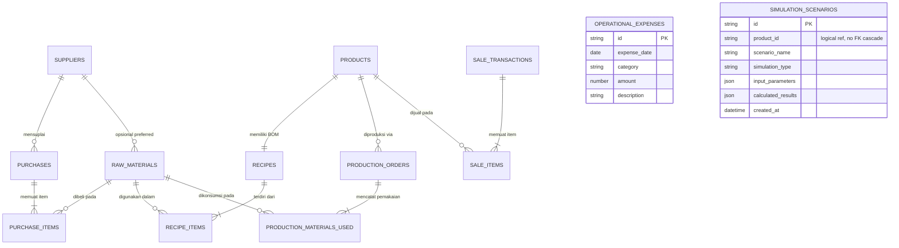

# Data Schema & Entity Specifications (SCHEMA)
## Sistem Bisnis Sederhana (SBS Sirkulatel)
*Dokumen Skema Basis Data & Kontrak Entitas — Versi 1.1 (MVP Rapikan)*
*Pendekatan: Spec-Driven Development (SDD)*

---

## 1. Entity Relationship Diagram (ERD)



`SIMULATION_SCENARIOS.product_id` **bukan** foreign key. Tidak ada `ON DELETE CASCADE` ke `products`. Penghapusan produk tidak boleh menghapus atau memblokir skenario.

---

## 2. Definisi Entitas & Tabel Lengkap

### 2.1 Entitas Master Data

#### Tabel: `suppliers` (Pemasok)
Master pemasok sederhana. Tidak wajib pada setiap pembelian.

| Kolom | Tipe Data | Constraint | Deskripsi |
| :--- | :--- | :--- | :--- |
| `id` | `VARCHAR(36)` | `PRIMARY KEY` | UUID v4 / CUID |
| `name` | `VARCHAR(100)` | `NOT NULL` | Nama pemasok |
| `phone` | `VARCHAR(30)` | `NULLABLE` | Nomor telepon |
| `notes` | `VARCHAR(255)` | `NULLABLE` | Catatan |
| `created_at` | `DATETIME` | `NOT NULL` | Waktu dibuat |
| `updated_at` | `DATETIME` | `NOT NULL` | Waktu diubah |

---

#### Tabel: `raw_materials` (Bahan Baku)
Menyimpan daftar seluruh bahan baku yang dibeli untuk proses produksi atau dijual eceran.

| Kolom | Tipe Data | Constraint | Deskripsi |
| :--- | :--- | :--- | :--- |
| `id` | `VARCHAR(36)` | `PRIMARY KEY` | UUID v4 / CUID identifier |
| `code` | `VARCHAR(20)` | `UNIQUE, NOT NULL` | Kode bahan (contoh: `MAT-TLR01`) |
| `name` | `VARCHAR(100)` | `NOT NULL` | Nama bahan |
| `unit` | `VARCHAR(20)` | `NOT NULL` | Satuan (`kg`, `gram`, `liter`, `ml`, `butir`, `pcs`) |
| `cost_per_unit` | `DECIMAL(12,2)` | `NOT NULL, >= 0` | Harga beli **terakhir** per 1 satuan (Rupiah) |
| `current_stock` | `DECIMAL(10,3)` | `NOT NULL, DEFAULT 0` | Jumlah stok riil |
| `min_stock_alert` | `DECIMAL(10,3)` | `NOT NULL, DEFAULT 5` | Ambang peringatan stok menipis |
| `supplier_id` | `VARCHAR(36)` | `NULLABLE` | Preferred supplier, referensi logis opsional |
| `created_at` | `DATETIME` | `NOT NULL` | Waktu data dibuat |
| `updated_at` | `DATETIME` | `NOT NULL` | Waktu data terakhir diubah |

---

#### Tabel: `products` (Produk Jadi Siap Jual)

| Kolom | Tipe Data | Constraint | Deskripsi |
| :--- | :--- | :--- | :--- |
| `id` | `VARCHAR(36)` | `PRIMARY KEY` | UUID v4 / CUID identifier |
| `code` | `VARCHAR(20)` | `UNIQUE, NOT NULL` | Kode produk (contoh: `PRD-PUD01`) |
| `name` | `VARCHAR(100)` | `NOT NULL` | Nama produk |
| `category` | `VARCHAR(50)` | `NOT NULL, DEFAULT 'Makanan'` | `Makanan`, `Minuman`, `Bahan Baku Ecer` |
| `selling_price` | `DECIMAL(12,2)` | `NOT NULL, >= 0` | Harga jual normal di kasir |
| `current_hpp` | `DECIMAL(12,2)` | `NOT NULL, DEFAULT 0` | HPP acuan terkini dari kalkulasi resep |
| `current_stock` | `INT` | `NOT NULL, DEFAULT 0` | Stok barang jadi siap jual |
| `is_active` | `BOOLEAN` | `NOT NULL, DEFAULT TRUE` | Status aktif untuk kasir |
| `created_at` | `DATETIME` | `NOT NULL` | Waktu pembuatan |
| `updated_at` | `DATETIME` | `NOT NULL` | Waktu pembaruan |

---

#### Tabel: `recipes` (Master Resep / Formula Produk)

| Kolom | Tipe Data | Constraint | Deskripsi |
| :--- | :--- | :--- | :--- |
| `id` | `VARCHAR(36)` | `PRIMARY KEY` | UUID v4 |
| `product_id` | `VARCHAR(36)` | `UNIQUE, FK -> products(id)` | Produk yang diasosiasikan |
| `batch_yield_qty` | `INT` | `NOT NULL, DEFAULT 1` | Basis output resep (standar: 1 unit) |
| `packaging_cost` | `DECIMAL(10,2)` | `NOT NULL, DEFAULT 0` | Biaya kemasan per porsi |
| `direct_overhead` | `DECIMAL(10,2)` | `NOT NULL, DEFAULT 0` | Alokasi listrik/gas/tenaga langsung per unit |
| `notes` | `TEXT` | `NULLABLE` | Catatan pembuatan |
| `updated_at` | `DATETIME` | `NOT NULL` | Waktu resep diperbarui |

---

#### Tabel: `recipe_items` (Rincian Komposisi Bahan Baku BOM)

| Kolom | Tipe Data | Constraint | Deskripsi |
| :--- | :--- | :--- | :--- |
| `id` | `VARCHAR(36)` | `PRIMARY KEY` | UUID v4 |
| `recipe_id` | `VARCHAR(36)` | `FK -> recipes(id), CASCADE` | Hubungan ke header resep |
| `material_id` | `VARCHAR(36)` | `FK -> raw_materials(id)` | Bahan baku yang dipakai |
| `quantity_required` | `DECIMAL(10,4)` | `NOT NULL, > 0` | Jumlah bahan per unit porsi (satuan bahan) |

---

### 2.2 Entitas Pengadaan (Pembelian / Restok)

Pembelian bahan **bukan** `operational_expenses`. Commit = satu transaksi ACID: stok naik + `cost_per_unit` = harga pembelian ini.

#### Tabel: `purchases` (Header Pembelian Bahan)

| Kolom | Tipe Data | Constraint | Deskripsi |
| :--- | :--- | :--- | :--- |
| `id` | `VARCHAR(36)` | `PRIMARY KEY` | UUID v4 |
| `purchase_date` | `DATE` | `NOT NULL` | Tanggal beli |
| `supplier_id` | `VARCHAR(36)` | `NULLABLE` | Referensi supplier, tidak wajib |
| `supplier_name_snapshot` | `VARCHAR(100)` | `NULLABLE` | Nama pemasok saat transaksi |
| `total_amount` | `DECIMAL(12,2)` | `NOT NULL, >= 0` | Total nilai belanja |
| `notes` | `VARCHAR(255)` | `NULLABLE` | Catatan |
| `created_at` | `DATETIME` | `NOT NULL` | Waktu pencatatan |

---

#### Tabel: `purchase_items` (Rincian Item Pembelian)

| Kolom | Tipe Data | Constraint | Deskripsi |
| :--- | :--- | :--- | :--- |
| `id` | `VARCHAR(36)` | `PRIMARY KEY` | UUID v4 |
| `purchase_id` | `VARCHAR(36)` | `FK -> purchases(id), CASCADE` | Header pembelian |
| `material_id` | `VARCHAR(36)` | `FK -> raw_materials(id)` | Bahan yang dibeli |
| `quantity` | `DECIMAL(10,3)` | `NOT NULL, > 0` | Jumlah masuk stok |
| `unit_cost` | `DECIMAL(12,2)` | `NOT NULL, >= 0` | Harga beli per satuan |
| `subtotal` | `DECIMAL(12,2)` | `NOT NULL` | `quantity * unit_cost` |

---

### 2.3 Entitas Transaksional Aktual (Actual Operational Store)

#### Tabel: `production_orders` (Pencatatan Produksi Aktual)

| Kolom | Tipe Data | Constraint | Deskripsi |
| :--- | :--- | :--- | :--- |
| `id` | `VARCHAR(36)` | `PRIMARY KEY` | UUID v4 |
| `batch_code` | `VARCHAR(30)` | `UNIQUE, NOT NULL` | Kode batch (contoh: `BATCH-20260905-01`) |
| `production_date` | `DATE` | `NOT NULL` | Tanggal produksi |
| `product_id` | `VARCHAR(36)` | `FK -> products(id)` | Produk yang dimasak |
| `target_quantity` | `INT` | `NOT NULL, > 0` | Rencana jumlah unit |
| `actual_yield_quantity` | `INT` | `NULLABLE` | Hasil jadi riil; wajib saat `COMPLETED` |
| `status` | `VARCHAR(20)` | `NOT NULL, DEFAULT 'DRAFT'` | `DRAFT`, `VALIDATED`, `PROCESSING`, `COMPLETED`, `CANCELLED` |
| `source` | `VARCHAR(20)` | `NOT NULL, DEFAULT 'MANUAL'` | `MANUAL` atau `SIMULATOR_COPY` |
| `total_raw_material_cost` | `DECIMAL(12,2)` | `NULLABLE` | Diisi saat konfirmasi |
| `total_packaging_cost` | `DECIMAL(12,2)` | `NULLABLE` | Diisi saat konfirmasi |
| `total_batch_cost` | `DECIMAL(12,2)` | `NULLABLE` | Diisi saat konfirmasi |
| `actual_hpp_per_unit` | `DECIMAL(12,2)` | `NULLABLE` | `total_batch_cost / actual_yield_quantity` |
| `notes` | `VARCHAR(255)` | `NULLABLE` | Catatan (misal: gosong 2 pcs) |
| `created_at` | `DATETIME` | `NOT NULL` | Waktu pencatatan batch |

**Aturan status:**
- `DRAFT` dari Dapur atau dari simulator (`source = SIMULATOR_COPY`): stok belum berubah.
- Transisi ke `COMPLETED` memotong stok bahan, menambah stok barang jadi, dan mengisi kolom biaya/HPP.
- `CANCELLED` pada draf: tidak ada mutasi stok.

---

#### Tabel: `production_materials_used` (Audit Pengurangan Stok Produksi)
Hanya ditulis saat produksi `COMPLETED`.

| Kolom | Tipe Data | Constraint | Deskripsi |
| :--- | :--- | :--- | :--- |
| `id` | `VARCHAR(36)` | `PRIMARY KEY` | UUID v4 |
| `production_order_id` | `VARCHAR(36)` | `FK -> production_orders(id)` | Referensi batch |
| `material_id` | `VARCHAR(36)` | `FK -> raw_materials(id)` | Bahan yang terpakai |
| `quantity_used` | `DECIMAL(10,3)` | `NOT NULL` | Jumlah bahan riil yang dipotong |
| `unit_cost_snapshot` | `DECIMAL(12,2)` | `NOT NULL` | Snapshot harga bahan saat batch dikonfirmasi |
| `subtotal_cost` | `DECIMAL(12,2)` | `NOT NULL` | Subtotal biaya bahan ini |

---

#### Tabel: `sale_transactions` (Transaksi Penjualan Kasir)

| Kolom | Tipe Data | Constraint | Deskripsi |
| :--- | :--- | :--- | :--- |
| `id` | `VARCHAR(36)` | `PRIMARY KEY` | UUID v4 |
| `invoice_number` | `VARCHAR(30)` | `UNIQUE, NOT NULL` | Nomor nota |
| `transaction_time` | `DATETIME` | `NOT NULL` | Waktu transaksi kasir |
| `total_amount` | `DECIMAL(12,2)` | `NOT NULL` | Total tagihan omzet |
| `total_hpp_cost` | `DECIMAL(12,2)` | `NOT NULL` | Total modal HPP barang terjual |
| `gross_profit` | `DECIMAL(12,2)` | `NOT NULL` | `total_amount - total_hpp_cost` |
| `payment_method` | `VARCHAR(20)` | `NOT NULL` | `TUNAI`, `TRANSFER`, `QRIS` |
| `notes` | `VARCHAR(255)` | `NULLABLE` | Catatan kasir |

---

#### Tabel: `sale_items` (Rincian Produk Terjual)

| Kolom | Tipe Data | Constraint | Deskripsi |
| :--- | :--- | :--- | :--- |
| `id` | `VARCHAR(36)` | `PRIMARY KEY` | UUID v4 |
| `sale_transaction_id` | `VARCHAR(36)` | `FK -> sale_transactions(id)` | Hubungan nota |
| `product_id` | `VARCHAR(36)` | `FK -> products(id)` | Produk yang dibeli |
| `quantity` | `INT` | `NOT NULL, > 0` | Kuantitas terjual |
| `unit_price` | `DECIMAL(12,2)` | `NOT NULL` | Harga satuan saat transaksi |
| `unit_hpp` | `DECIMAL(12,2)` | `NOT NULL` | HPP per unit saat transaksi |
| `subtotal_amount` | `DECIMAL(12,2)` | `NOT NULL` | Subtotal omzet |
| `subtotal_gross_profit` | `DECIMAL(12,2)` | `NOT NULL` | Subtotal laba kotor item |

---

#### Tabel: `operational_expenses` (Beban Biaya Operasional)
Pengeluaran non-bahan baku. Terpisah dari `purchases`.

| Kolom | Tipe Data | Constraint | Deskripsi |
| :--- | :--- | :--- | :--- |
| `id` | `VARCHAR(36)` | `PRIMARY KEY` | UUID v4 |
| `expense_date` | `DATE` | `NOT NULL` | Tanggal pengeluaran |
| `category` | `VARCHAR(50)` | `NOT NULL` | `Sewa`, `Gaji`, `Listrik/Air`, `Pemasaran`, `Transportasi`, `Lainnya` |
| `amount` | `DECIMAL(12,2)` | `NOT NULL, > 0` | Nilai nominal |
| `description` | `VARCHAR(255)` | `NOT NULL` | Keterangan |

---

### 2.4 Entitas Business Simulator (Sandbox Store — Terisolasi)

#### Tabel: `simulation_scenarios`

Menyimpan snapshot eksperimen "What-If". **Tidak ada trigger, foreign key cascade, atau pengaruh ke stok/kas riil.**

| Kolom | Tipe Data | Constraint | Deskripsi |
| :--- | :--- | :--- | :--- |
| `id` | `VARCHAR(36)` | `PRIMARY KEY` | UUID v4 |
| `scenario_name` | `VARCHAR(50)` | `NOT NULL` | Label (contoh: `Skenario A`) |
| `product_id` | `VARCHAR(36)` | `NOT NULL` | ID produk — referensi logis, **bukan FK** |
| `product_name` | `VARCHAR(100)` | `NOT NULL` | Snapshot nama produk |
| `simulation_type` | `VARCHAR(30)` | `NOT NULL` | `HARGA_JUAL`, `JUMLAH_PRODUKSI`, `KENAIKAN_BAHAN`, `TARGET_OMZET` |
| `input_parameters` | `JSON / TEXT` | `NOT NULL` | Lihat skema JSON di bawah |
| `calculated_results` | `JSON / TEXT` | `NOT NULL` | Lihat skema JSON di bawah |
| `created_at` | `DATETIME` | `NOT NULL` | Waktu skenario disimpan |

Sesi kerja yang belum disimpan **tidak** ditulis ke tabel ini; hanya objek memori.

##### JSON `input_parameters`

```json
{
  "productId": "prd-pud01",
  "productionQty": 100,
  "simulatedSellingPrice": 5000,
  "customMaterialCosts": { "mat-tlr01": 2500 },
  "packagingCostOverride": null,
  "directOverheadOverride": null,
  "allocatedFixedCost": null,
  "targetRevenue": null,
  "targetProfit": null
}
```

##### JSON `calculated_results`

```json
{
  "hppPerUnit": 2100,
  "totalEstimatedCost": 210000,
  "potentialRevenue": 500000,
  "potentialGrossProfit": 290000,
  "grossMarginPercentage": 58,
  "breakEvenUnits": null,
  "breakEvenRevenue": null,
  "targetUnitsFromRevenue": null,
  "targetUnitsFromProfit": null,
  "materialRequirements": [],
  "humanInsightText": "Margin 58.0% tergolong sehat."
}
```

`markupPercentage` boleh ada di payload engine, **tidak** wajib disimpan atau ditampilkan.

---

## 3. Data Integrity & Validation Constraints

1. **Anti Negative Constraint**: kuantitas dan nilai moneter `>= 0`.
2. **Rounding Rule**: Rupiah dibulatkan `Math.round`. Kuantitas bahan hingga 4 desimal.
3. **Pemisahan Jalur Transaksi**:
   - Aktual: Dexie transaction ACID (pembelian, konfirmasi produksi, penjualan).
   - Simulasi kerja: pure memory, tanpa write transaction.
   - Simpan skenario: write hanya ke `simulation_scenarios`.
   - Salin ke dapur: insert `production_orders` `DRAFT` tanpa mutasi stok.
4. **HPP**:
   - `products.current_hpp` = HPP resep (target yield).
   - `production_orders.actual_hpp_per_unit` = biaya batch ÷ actual yield, hanya saat `COMPLETED`.
