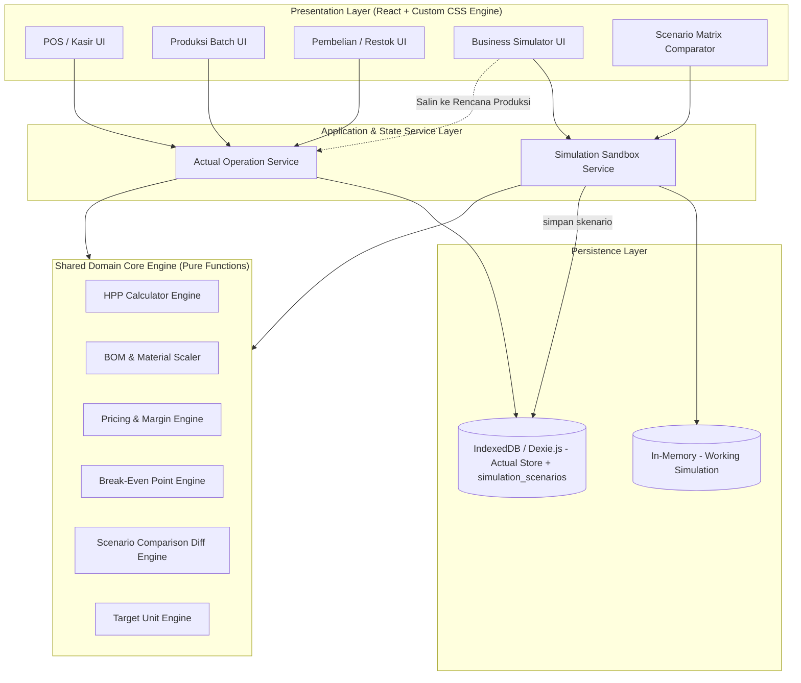
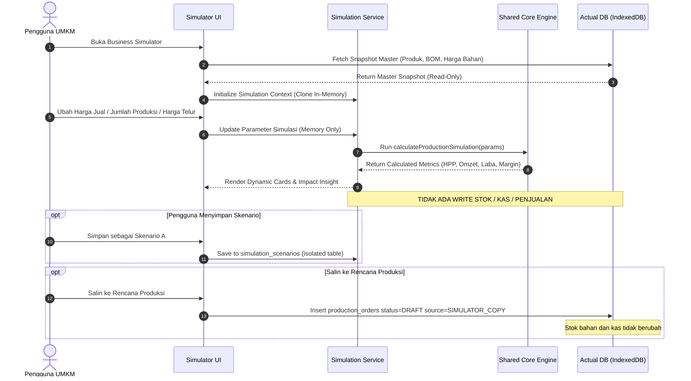

# Technical Requirements Document (TRD)
## Sistem Bisnis Sederhana (SBS Sirkulatel)
*Dokumen Arsitektur & Spesifikasi Rekayasa Perangkat Lunak — Versi 1.1 (MVP Rapikan)*
*Pendekatan: Spec-Driven Development (SDD)*

---

## 1. Arsitektur Sistem Global

Sistem SBS Sirkulatel dirancang dengan pola **Clean Architecture / Layered Domain-Driven Design (DDD)** yang mengedepankan prinsip:
> **"Single Source of Truth for Business Mathematics"**

Rumus kalkulasi bisnis diisolasi sebagai **Pure Functions (Stateless Engine)** tanpa dependensi I/O, database, atau framework UI. Mesin ini dipanggil oleh dua jalur konsumen terpisah:
1. **Actual Transaction Consumer** (Pembelian bahan, Produksi aktual, Penjualan kasir, Laporan aktual)
2. **Simulation Consumer** (Business Simulator MVP, Scenario comparison sandbox)

Jalur ketiga hanya untuk jembatan eksplisit:
3. **Draft Handoff** — `copySimulationToProductionDraft` menulis `production_orders` berstatus `DRAFT`. Tidak memotong stok.



**Aturan persistensi simulasi:**
- Sesi kerja simulator = **in-memory** (clone snapshot master). Tidak ada write stok/kas.
- Skenario yang disimpan pengguna = tabel `simulation_scenarios` (terisolasi).
- `simulation_scenarios.product_id` adalah **referensi logis** (string ID). Bukan foreign key cascade. Menghapus produk tidak boleh menghapus atau memblokir skenario; skenario tetap menyimpan `product_name` snapshot.

---

## 2. Shared Business Logic & Formula Specification

Untuk memenuhi **Addendum Business Simulator** (Reuse Business Logic tanpa rumus terpisah), formula berikut diterapkan secara matematis seragam di seluruh aplikasi.

### 2.1 Formula Biaya Bahan Baku & Kemasan
Untuk sebuah produk dengan Bill of Materials (BOM) sejumlah $n$ jenis bahan baku:

$$\text{Biaya Bahan Baku per Unit} = \sum_{i=1}^{n} \left( \text{Kuantitas Bahan}_i \times \text{Harga Satuan Bahan}_i \right)$$

$$\text{Biaya Total per Unit} = \text{Biaya Bahan Baku per Unit} + \text{Biaya Kemasan per Unit} + \text{Overhead Langsung per Unit}$$

Harga satuan bahan = `raw_materials.cost_per_unit` (harga beli **terakhir**), kecuali simulator meng-override harga bahan tertentu.

### 2.2 Formula HPP — Aktual vs Simulasi
Rumus biaya per unit dari BOM **identik**. Pembagi hasil jadi yang berbeda:

$$\text{Total Biaya Batch} = \text{Biaya Total per Unit} \times \text{Jumlah Unit Target}$$

| Konteks | Pembagi HPP | Keterangan |
| :--- | :--- | :--- |
| **Simulasi** | Target unit simulasi | Tidak ada yield loss. |
| **Produksi aktual** | `actual_yield_quantity` | HPP riil $= \text{total_batch_cost} / \text{actual_yield}$. Jika gosong 2 dari 100, pembagi = 98. |

Perbedaan angka HPP simulasi vs batch terakhir **hanya** boleh berasal dari yield, bukan dari rumus terpisah. Kolom "Kondisi Aktual" di komparator memakai HPP resep (seperti simulasi tanpa override), bukan HPP batch terakhir. HPP batch terakhir boleh ditampilkan sebagai catatan terpisah.

### 2.3 Formula Penjualan & Keuntungan
$$\text{Potensi Omzet} = \text{Jumlah Unit} \times \text{Harga Jual per Unit}$$

$$\text{Estimasi Laba Kotor} = \text{Potensi Omzet} - \text{Total Biaya Batch}$$

$$\text{Margin Laba Kotor (\%)} = \left( \frac{\text{Estimasi Laba Kotor}}{\text{Potensi Omzet}} \right) \times 100\%$$

Markup boleh dihitung di engine untuk keperluan internal/tes. **Markup tidak ditampilkan di UI.**

### 2.4 Target Unit (Use Case 4)
Default — dari target omzet:

$$\text{Target Unit} = \left\lceil \frac{\text{Target Omzet}}{\text{Harga Jual per Unit}} \right\rceil$$

Opsi lanjutan — dari target laba, hanya jika laba kotor per unit $> 0$:

$$\text{Target Unit} = \left\lceil \frac{\text{Target Laba}}{\text{Harga Jual} - \text{HPP per Unit}} \right\rceil$$

### 2.5 Break-Even Point (hanya jika relevan)
BEP dihitung **hanya** jika `allocatedFixedCost > 0`. Jika 0 atau kosong, `breakEvenUnits` dan `breakEvenRevenue` = `null` dan UI tidak menampilkan kartu BEP.

$$\text{BEP (Unit)} = \left\lceil \frac{FC}{\text{Harga Jual per Unit} - \text{HPP per Unit}} \right\rceil$$

### 2.6 Pembelian Bahan (Harga Terakhir)
Pada commit pembelian:

$$\text{stok baru} = \text{stok lama} + \text{qty beli}$$

$$\text{cost\_per\_unit} = \text{unit\_cost pembelian ini}$$

MVP memakai **harga beli terakhir**, bukan rata-rata tertimbang. Snapshot harga tetap disimpan di `purchase_items` dan `production_materials_used`.

---

## 3. Isolasi Data Aktual vs Simulator (Data Decoupling)



### Aturan Keamanan Data
1. **Read-Only Cloned Snapshot**: Saat membuka simulator, data produk dan resep di-*deep clone* ke state lokal / memori sandbox.
2. **No Trigger to Inventory pada simulasi**: Operasi simulasi dan simpan skenario tidak pernah memicu `STOCK_REDUCED`, `STOCK_INCREASED`, `CASH_OUT`, atau `JOURNAL_ENTRY`.
3. **Penyimpanan skenario terpisah**: Tabel `simulation_scenarios` tidak punya FK cascade ke produk, stok, atau transaksi riil.
4. **Draft bukan commit**: `copySimulationToProductionDraft` hanya insert draf. Potong stok hanya di `confirmProduction(orderId)` pada Actual Service.

### Definisi Kondisi Aktual (komparator)
`baselineActual` = pemanggilan engine yang sama dengan:
- `productionQty` = qty skenario acuan (default Skenario A),
- `simulatedSellingPrice` = `products.selling_price` saat ini,
- tanpa `customMaterialCosts`,
- kemasan & overhead dari resep saat ini.

---

## 4. Spesifikasi Kontrak Kode (Core Engine Interfaces)

Semua modul engine ditulis dalam TypeScript murni:

```typescript
export type UnitType = 'kg' | 'gram' | 'liter' | 'ml' | 'butir' | 'pcs' | 'pack';

export type ProductionOrderStatus =
  | 'DRAFT'
  | 'VALIDATED'
  | 'PROCESSING'
  | 'COMPLETED'
  | 'CANCELLED';

export type ProductionOrderSource = 'MANUAL' | 'SIMULATOR_COPY';

export interface RawMaterialCost {
  materialId: string;
  name: string;
  unit: UnitType;
  costPerUnit: number;
}

export interface BOMItemSpec {
  materialId: string;
  quantityRequired: number;
}

export interface ProductRecipeSpec {
  productId: string;
  productName: string;
  items: BOMItemSpec[];
  packagingCostPerUnit: number;
  directOverheadPerUnit: number;
  defaultSellingPrice: number;
}

export interface SimulationInputParams {
  productId: string;
  productionQty: number;
  simulatedSellingPrice: number;
  customMaterialCosts?: Record<string, number>;
  packagingCostOverride?: number;
  directOverheadOverride?: number;
  allocatedFixedCost?: number;
  targetRevenue?: number;
  targetProfit?: number;
}

export interface MaterialRequirementDetail {
  materialId: string;
  materialName: string;
  unit: UnitType;
  unitCostUsed: number;
  totalQuantityNeeded: number;
  totalCost: number;
}

export interface SimulationResultOutput {
  productId: string;
  productionQty: number;
  sellingPricePerUnit: number;
  hppPerUnit: number;
  totalEstimatedCost: number;
  potentialRevenue: number;
  potentialGrossProfit: number;
  grossMarginPercentage: number;
  markupPercentage: number;
  breakEvenUnits: number | null;
  breakEvenRevenue: number | null;
  targetUnitsFromRevenue: number | null;
  targetUnitsFromProfit: number | null;
  materialRequirements: MaterialRequirementDetail[];
  humanInsightText: string;
}

export interface ProductionDraftPayload {
  productId: string;
  targetQuantity: number;
  source: 'SIMULATOR_COPY';
  status: 'DRAFT';
  notes?: string;
}

export interface ScenarioComparisonMatrix {
  baselineActual: SimulationResultOutput;
  scenarioA: SimulationResultOutput;
  scenarioB?: SimulationResultOutput;
  deltas: {
    deltaProductionQty: number;
    deltaRevenue: number;
    deltaProfit: number;
    deltaMarginPctPoints: number;
    deltaHpp: number;
  };
  summaryInsight: string;
}
```

---

## 5. Implementasi Shared Functions

```typescript
export class SBSCoreEngine {
  public static calculateHPP(
    recipe: ProductRecipeSpec,
    materialsCostMap: Map<string, number>,
    batchQty: number = 1,
    overrides?: { packagingCostPerUnit?: number; directOverheadPerUnit?: number }
  ): { hppPerUnit: number; totalCost: number; materialsCostTotal: number } {
    let rawMaterialCostPerUnit = 0;

    for (const item of recipe.items) {
      const unitCost = materialsCostMap.get(item.materialId) ?? 0;
      rawMaterialCostPerUnit += item.quantityRequired * unitCost;
    }

    const packaging = overrides?.packagingCostPerUnit ?? recipe.packagingCostPerUnit;
    const overhead = overrides?.directOverheadPerUnit ?? recipe.directOverheadPerUnit;
    const totalUnitCost = rawMaterialCostPerUnit + packaging + overhead;
    const totalBatchCost = totalUnitCost * batchQty;

    return {
      hppPerUnit: Math.round(totalUnitCost),
      totalCost: Math.round(totalBatchCost),
      materialsCostTotal: Math.round(rawMaterialCostPerUnit * batchQty),
    };
  }

  public static calculateActualBatchHpp(
    totalBatchCost: number,
    actualYieldQuantity: number
  ): number {
    if (actualYieldQuantity <= 0) return 0;
    return Math.round(totalBatchCost / actualYieldQuantity);
  }

  public static calculateTargetUnitsFromRevenue(
    targetRevenue: number,
    sellingPrice: number
  ): number {
    if (sellingPrice <= 0) return 0;
    return Math.ceil(targetRevenue / sellingPrice);
  }

  public static calculateTargetUnitsFromProfit(
    targetProfit: number,
    sellingPrice: number,
    hppPerUnit: number
  ): number {
    const profitPerUnit = sellingPrice - hppPerUnit;
    if (profitPerUnit <= 0) return 0;
    return Math.ceil(targetProfit / profitPerUnit);
  }

  public static simulateProductionAndPricing(
    recipe: ProductRecipeSpec,
    baseMaterialsMap: Map<string, RawMaterialCost>,
    params: SimulationInputParams
  ): SimulationResultOutput {
    const effectiveCostMap = new Map<string, number>();
    baseMaterialsMap.forEach((mat, id) => {
      const overridden = params.customMaterialCosts?.[id];
      effectiveCostMap.set(id, overridden !== undefined ? overridden : mat.costPerUnit);
    });

    const costResult = this.calculateHPP(
      recipe,
      effectiveCostMap,
      params.productionQty,
      {
        packagingCostPerUnit: params.packagingCostOverride,
        directOverheadPerUnit: params.directOverheadOverride,
      }
    );

    const potentialRevenue = params.productionQty * params.simulatedSellingPrice;
    const potentialGrossProfit = potentialRevenue - costResult.totalCost;
    const grossMarginPct = potentialRevenue > 0
      ? (potentialGrossProfit / potentialRevenue) * 100
      : 0;
    const markupPct = costResult.hppPerUnit > 0
      ? ((params.simulatedSellingPrice - costResult.hppPerUnit) / costResult.hppPerUnit) * 100
      : 0;

    const fixedCost = params.allocatedFixedCost ?? 0;
    const contributionMarginPerUnit = params.simulatedSellingPrice - costResult.hppPerUnit;
    const breakEvenUnits = fixedCost > 0 && contributionMarginPerUnit > 0
      ? Math.ceil(fixedCost / contributionMarginPerUnit)
      : null;
    const breakEvenRevenue = breakEvenUnits !== null
      ? breakEvenUnits * params.simulatedSellingPrice
      : null;

    const targetUnitsFromRevenue = params.targetRevenue
      ? this.calculateTargetUnitsFromRevenue(params.targetRevenue, params.simulatedSellingPrice)
      : null;
    const targetUnitsFromProfit = params.targetProfit
      ? this.calculateTargetUnitsFromProfit(
          params.targetProfit,
          params.simulatedSellingPrice,
          costResult.hppPerUnit
        )
      : null;

    const materialReqs: MaterialRequirementDetail[] = recipe.items.map((item) => {
      const mat = baseMaterialsMap.get(item.materialId);
      const unitCost = effectiveCostMap.get(item.materialId) ?? 0;
      const totalQty = item.quantityRequired * params.productionQty;
      return {
        materialId: item.materialId,
        materialName: mat?.name ?? 'Bahan',
        unit: mat?.unit ?? 'pcs',
        unitCostUsed: unitCost,
        totalQuantityNeeded: totalQty,
        totalCost: Math.round(totalQty * unitCost),
      };
    });

    return {
      productId: recipe.productId,
      productionQty: params.productionQty,
      sellingPricePerUnit: params.simulatedSellingPrice,
      hppPerUnit: costResult.hppPerUnit,
      totalEstimatedCost: costResult.totalCost,
      potentialRevenue,
      potentialGrossProfit,
      grossMarginPercentage: Number(grossMarginPct.toFixed(2)),
      markupPercentage: Number(markupPct.toFixed(2)),
      breakEvenUnits,
      breakEvenRevenue,
      targetUnitsFromRevenue,
      targetUnitsFromProfit,
      materialRequirements: materialReqs,
      humanInsightText: this.buildInsight(grossMarginPct, potentialGrossProfit),
    };
  }

  private static buildInsight(grossMarginPct: number, potentialGrossProfit: number): string {
    if (grossMarginPct < 20) {
      return 'Peringatan: Margin di bawah 20%. Sangat rentan rugi jika ada bahan terbuang.';
    }
    if (grossMarginPct >= 50) {
      return `Margin ${grossMarginPct.toFixed(1)}% tergolong sehat. Potensi laba kotor Rp${potentialGrossProfit.toLocaleString('id-ID')}.`;
    }
    return `Margin ${grossMarginPct.toFixed(1)}%. Pastikan volume penjualan stabil.`;
  }

  public static compareScenarios(
    baseline: SimulationResultOutput,
    scenarioA: SimulationResultOutput,
    scenarioB?: SimulationResultOutput
  ): ScenarioComparisonMatrix {
    const target = scenarioB ?? scenarioA;
    const deltaRevenue = target.potentialRevenue - baseline.potentialRevenue;
    const deltaProfit = target.potentialGrossProfit - baseline.potentialGrossProfit;
    const deltaMarginPctPoints = target.grossMarginPercentage - baseline.grossMarginPercentage;
    const deltaProductionQty = target.productionQty - baseline.productionQty;
    const deltaHpp = target.hppPerUnit - baseline.hppPerUnit;

    let summaryInsight = '';
    if (deltaProfit > 0 && deltaMarginPctPoints >= 0) {
      summaryInsight = `Skenario ini menaikkan laba kotor Rp${deltaProfit.toLocaleString('id-ID')} dan margin tidak turun.`;
    } else if (deltaProfit > 0 && deltaMarginPctPoints < 0) {
      summaryInsight = `Laba kotor naik Rp${deltaProfit.toLocaleString('id-ID')}, namun margin turun ${Math.abs(deltaMarginPctPoints).toFixed(1)} poin persentase.`;
    } else {
      summaryInsight = `Skenario ini menghasilkan laba kotor lebih rendah Rp${Math.abs(deltaProfit).toLocaleString('id-ID')} dibanding kondisi awal.`;
    }

    return {
      baselineActual: baseline,
      scenarioA,
      scenarioB,
      deltas: {
        deltaProductionQty,
        deltaRevenue,
        deltaProfit,
        deltaMarginPctPoints: Number(deltaMarginPctPoints.toFixed(2)),
        deltaHpp,
      },
      summaryInsight,
    };
  }
}
```

### 5.1 Actual Service — Pembelian & Draf Produksi

```typescript
export interface PurchaseCommitInput {
  supplierId?: string;
  purchaseDate: string;
  items: Array<{ materialId: string; quantity: number; unitCost: number }>;
}

class ActualOperationService {
  async commitPurchase(input: PurchaseCommitInput): Promise<void> {
    // Satu transaksi ACID:
    // 1. insert purchases + purchase_items
    // 2. raw_materials.current_stock += quantity
    // 3. raw_materials.cost_per_unit = unitCost (harga terakhir)
    // Tidak menyentuh simulation_scenarios.
  }

  copySimulationToProductionDraft(params: {
    productId: string;
    targetQuantity: number;
  }): ProductionDraftPayload {
    return {
      productId: params.productId,
      targetQuantity: params.targetQuantity,
      source: 'SIMULATOR_COPY',
      status: 'DRAFT',
    };
  }

  async confirmProduction(orderId: string, actualYieldQuantity: number): Promise<void> {
    // Hanya di sini: STOCK_REDUCED bahan, STOCK_INCREASED barang jadi,
    // HPP = calculateActualBatchHpp(totalBatchCost, actualYieldQuantity)
  }
}
```

`copySimulationToProductionDraft` **tidak** memanggil `STOCK_REDUCED`.

### 5.2 Aturan teks insight
- Dilarang: "harga terbaik", "paling optimal", "skenario terbaik".
- Boleh membandingkan angka yang pengguna sudah coba.
- Kalkulasi balik harga untuk menjaga margin bersifat opsional dan informatif, bukan rekomendasi.

---

## 6. Persistensi & Arsitektur Data

1. **Actual Store (IndexedDB / Dexie.js)**:
   - `suppliers`
   - `raw_materials`
   - `purchases` & `purchase_items`
   - `recipes` & `recipe_items`
   - `products`
   - `production_orders` & `production_materials_used`
   - `sale_transactions` & `sale_items`
   - `operational_expenses`
2. **Isolated Simulator Store (tabel sama IndexedDB, tanpa relasi cascade)**:
   - `simulation_scenarios`
3. **Working simulation**: objek memori; hilang jika pengguna keluar tanpa menyimpan skenario.
4. **Sinkronisasi Siap Cloud**: model JSON-serializable untuk REST / Supabase / PostgreSQL di masa depan.

---

## 7. Rencana Pengujian (Testing Strategy)

- **Unit Tests**:
  - HPP resep pecahan desimal (contoh: 2.5 gram, 0.05 butir).
  - Margin 0% saat harga jual = HPP; margin negatif saat harga jual < HPP.
  - Override harga bahan mengubah HPP dan margin.
  - Target omzet Rp1.000.000 / Rp5.000 = 200 unit.
  - BEP `null` jika `allocatedFixedCost` kosong atau 0.
  - `calculateActualBatchHpp(210000, 98)` ≠ HPP simulasi 100 unit, rumus BOM tetap sama.
- **Isolation Tests**:
  - 1000 iterasi simulasi: `raw_materials`, `products`, `purchases` tidak berubah.
  - Simpan skenario tidak mengubah stok.
  - `copySimulationToProductionDraft` menambah 1 baris `DRAFT` dan tidak mengubah `current_stock`.
  - `confirmProduction` baru mengurangi stok bahan.
- **Purchase Tests**:
  - Commit pembelian menaikkan stok dan men-set `cost_per_unit` ke harga terakhir.
  - Pembelian tidak menulis ke `operational_expenses`.
- **Insight Tests**:
  - Output insight tidak mengandung "terbaik" atau "optimal".
